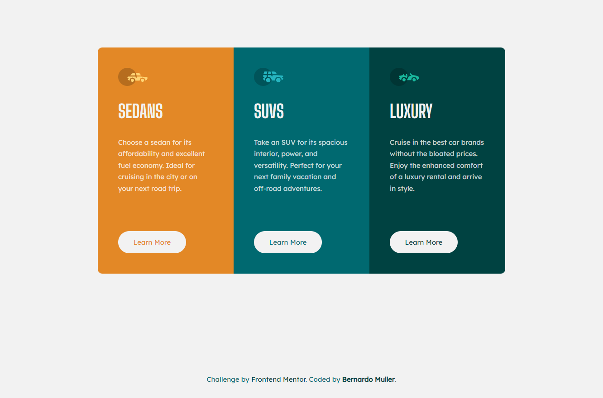

# Frontend Mentor - 3-column preview card component

**To do this challenge, you need a basic understanding of HTML, CSS and JavaScript.**

## The challenge

Your challenge is to build out this 3-column preview card component and get it looking as close to the design as possible.

You can use any tools you like to help you complete the challenge. So if you've got something you'd like to practice, feel free to give it a go.

Your users should be able to:

- View the optimal layout depending on their device's screen size
- See hover states for interactive elements

### Screenshot

### Links

- Live Site URL: [https://3-columns-previewcard.netlify.app/](My solution Live Site)

## My process

- Started by adding HTML tags and elements aswell as classes for future use.
- Thinking about the layout, in particular how the grid will behave in mobile/desktop view and how to make it work out.
- Working on the css, this time really doing a mobile first workflow
- Working on the active states.
- Testing and refining.

### Built with

- Semantic HTML5 markup
- CSS custom properties
- Flexbox
- CSS Grid
- Mobile-first workflow

### What I learned

- To use a simple broad class for general purpose and other classes for more specific objectives in the same element. 
- To get more confortable with Grid in general, ideally for media query stuff.
- The use of last/first/nth child to achieve the desired border radius in specific elements.
- To use 'box-shadow inset' to create an inside border that won't shift the element size.
